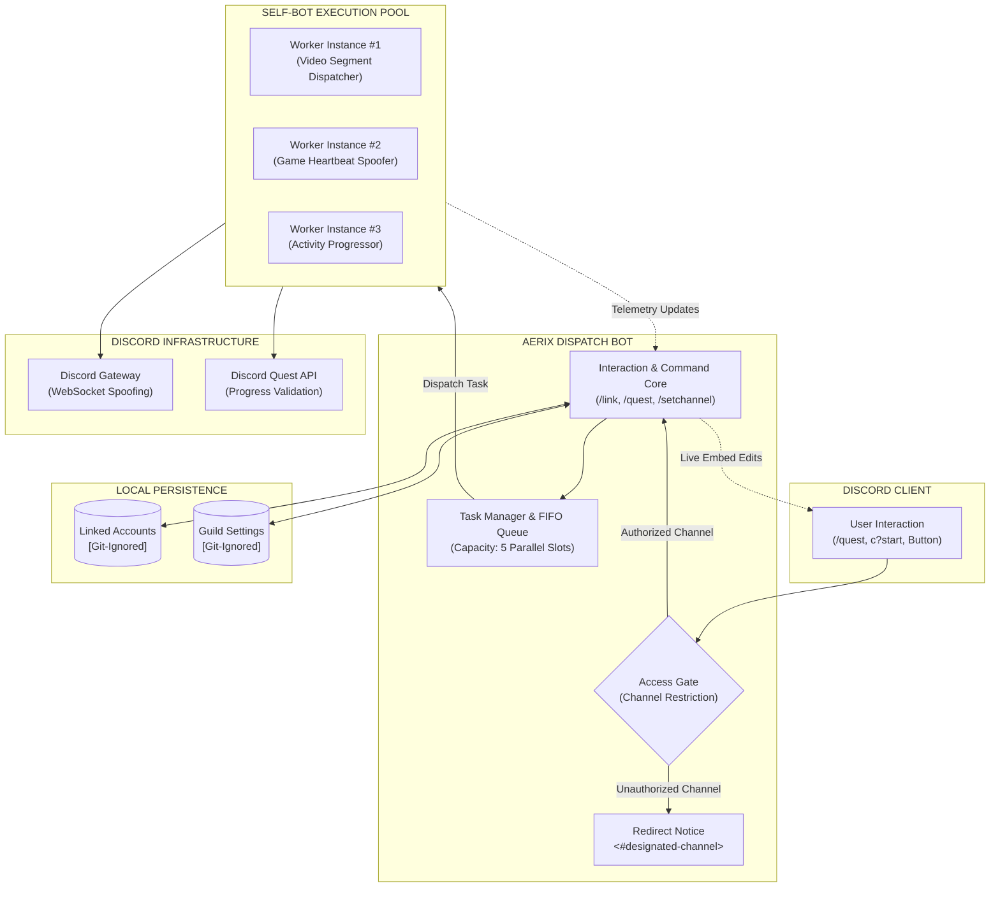

<div align="center">

# ◈ AERIX QUEST INFRASTRUCTURE ◈

### High-Performance Multi-User Discord Quest Automation Platform

[](https://www.typescriptlang.org/)
[](https://nodejs.org/)
[](https://discord.js.org/)
[](https://github.com/Bihariaayu/aerix-quest-bot)
[](https://github.com/Bihariaayu/aerix-quest-bot)
[](LICENSE)

<br/>

[Key Capabilities](#-key-capabilities) • [System Architecture](#-system-architecture) • [Interface Showcase](#-interface-showcase) • [Quick Start](#-quick-start) • [Command Matrix](#-command-matrix) • [Governance & Channel Control](#-governance--channel-control) • [Token Extraction](#-token-extraction-guide) • [Production Deployment](#-production-deployment)

</div>

---

## ◈ Overview

**Aerix Quest** transforms Discord quest auto-completion into an enterprise-grade, multi-user infrastructure. Built on top of **Discord.js v14** and TypeScript, it allows entire Discord communities to concurrently accept, progress, and complete all active Discord Quests directly in the background without installing external game clients, launching games, or running local scripts.

Engineered with an executive **Obsidian Purple (`#6D28D9`)** aesthetic, closed-box prolog formatting, live telemetry, and **strictly zero emojis**, Aerix Quest delivers a clean, professional, and reliable user experience.

---

## ◈ Interface Showcase

### 1. Real-Time System Monitor
Live-updating telemetry dashboard monitoring queue state, elapsed execution time, and individual quest progression:

```prolog
┌── SESSION PROFILE ──────────────────────────┐
│ OPERATOR   : @aerixusfr.
│ IDENTIFIER : 1549986876096651274
│ STATUS     : ACTIVE
│ DURATION   : 02m 45s
│ CAPACITY   : [3/5 SLOTS]
└──────────────────────────────────────────────┘
```
**EXECUTION PROGRESS**
`[■■■■■■■■□□□□]` `67%` `[2/3 QUESTS]`

◈ **Fortnite Play Quest**
  └─ `[CLIENT]` `COMPLETED`
◈ **The Finals Video Stream**
  └─ `[VIDEO]` `45% · PROGRESS REPORTED [180s/400s]`
◈ **Discord Activity Task**
  └─ `[ACTIVITY]` `PENDING`

---

### 2. Interactive Control Station
Persistent deployment panel for server channels with integrated dispatch buttons:

```prolog
┌── QUEST AUTOMATION SYSTEM ─────────────────┐
│ AERIX HIGH-PERFORMANCE DISPATCH CORE         │
├──────────────────────────────────────────────┤
│ ◈ CONCURRENT MULTI-SESSION EXECUTION         │
│ ◈ AUTOMATED VIDEO & HEARTBEAT DISPATCH       │
│ ◈ SEAMLESS BACKGROUND SCHEDULING             │
│ ◈ ENCRYPTED LOCAL CREDENTIAL STORAGE         │
└──────────────────────────────────────────────┘
```
`[ INITIALIZE ]` `[ LINK ACCOUNT ]` `[ DOCUMENTATION ]`

---

### 3. Channel Access Control
Automated boundary enforcement redirecting off-channel interactions:

```prolog
┌── CHANNEL RESTRICTION ────────────────────┐
│ ACCESS RESTRICTED TO DESIGNATED CHANNEL      │
└──────────────────────────────────────────────┘
Quest commands are not permitted in this channel.

If you want to use the quest bot, please use #quest-terminal.
```
`[ GO TO CHANNEL ]`

---

## ◈ Key Capabilities

| Capability | Technical Implementation | Value |
| :--- | :--- | :--- |
| **Concurrent Multi-Tenancy** | Asynchronous FIFO task scheduler with dynamic slot limits (`MAX_CONCURRENT_USERS`). | Multiple users can run quests at the exact same moment without interference or rate-limiting collisions. |
| **Background Auto-Pilot** | Continuous daemon scanner (every 20m) querying `/quests/@me` via browser-spoofed REST. | Automatically detects newly dropped Discord quests, dispatches worker tasks, and delivers completion notifications to your DMs. |
| **Execution Strategy Selection** | Configurable execution modes: `ONE BY ONE` (sequential) or `ALL AT ONCE` (concurrent). | Select between rock-solid sequential processing or high-speed parallel completion across all eligible quests. |
| **Persistent Credential Linking** | Encrypted local key-value store (`data/linked_accounts.json`) with auto-reloading. | Users associate credentials once via `/link` or `c?link` and execute on demand with a single click or let Auto-Pilot take over. |
| **Daemon Crash & Restart Recovery** | Persistent active task ledger (`data/active_tasks.json`) with graceful signal handling (`SIGINT`/`SIGTERM`). | Restarts, code updates, or PM2 reloads never lose quest progress. Interrupted tasks are automatically restored and resumed on reboot. |
| **Universal Quest Engine** | Automated video chunk dispatching, gateway game spoofing, and embedded activity launch. | Solves every quest variant: `WATCH_VIDEO`, `PLAY_ON_DESKTOP`, `PLAY_ON_XBOX`, and `PLAY_ACTIVITY`. |
| **Channel Governance** | Server-level channel routing engine with auto-redirection embeds and link buttons. | Keeps general server channels clean by isolating quest operations to designated channels. |
| **Instant Guild Sync** | Dual-tier slash registration (`Routes.applicationGuildCommands` + `applicationCommands`). | Zero delay on command updates; changes appear in Discord clients instantly. |
| **Ephemeral Privacy** | Ephemeral interactions, private Discord modals, and automated channel message deletion. | User tokens typed in chat are purged within milliseconds to prevent exposure. |

---

## ◈ System Architecture



---

## ◈ Quick Start

### 1. Prerequisites
- **Node.js**: v18.0.0 or higher
- **Discord Bot Token**: From the [Discord Developer Portal](https://discord.com/developers/applications)

### 2. Installation

```bash
# Clone the repository
git clone https://github.com/Bihariaayu/aerix-quest-bot.git
cd aerix-quest-bot

# Install dependencies
npm install
```

### 3. Discord Developer Portal Setup

1. Create a **New Application** at [discord.com/developers/applications](https://discord.com/developers/applications).
2. Under the **Bot** tab:
   - Click **Reset Token** and copy your token.
   - **Crucial**: Under **Privileged Gateway Intents**, turn **ON**:
     - `Message Content Intent` (Required for `c?` prefix commands)
     - `Server Members Intent`
3. Under **OAuth2 ➔ URL Generator**:
   - Scopes: `bot`, `applications.commands`
   - Permissions: `Send Messages`, `Embed Links`, `Attach Files`, `Read Message History`, `Manage Messages`
   - Open the generated authorization URL to invite the bot to your guild.

### 4. Configuration

```bash
# Copy example environment configuration
cp .env.example .env
```

Configure your `.env` file:

```ini
# Primary Discord Bot Token (Required)
DISCORD_BOT_TOKEN=MTU1NjY4MTc4ODM5MzM5ODI5Mg...

# Maximum concurrent quest sessions allowed at once (Default: 5)
MAX_CONCURRENT_USERS=5

# Optional: Global webhook URL for administrative audit logging
WEBHOOK_URL=

# Optional: YesCaptcha API key for rare captcha validation
YES_CAPTCHA_API_KEY=
```

### 5. Launch

```bash
# Standard runtime
npm run start
```

---

## ◈ Command Matrix

The bot provides full parity across both **Slash Commands** (`/...`) and **Prefix Commands** (`c?...`).

### Operator Commands

| Slash Command | Prefix Command | Scope | Description |
| :--- | :--- | :--- | :--- |
| `/quest start [mode] [token]` | `c?start [mode]` | All Users | Initiates quest auto-completion. Choose `one_by_one` (sequential) or `all_at_once` (concurrent). |
| `/auto [state] [mode]` | `c?auto [on/off]` | All Users | Toggles 24/7 background Auto-Pilot. Automatically detects and completes new quests when they drop. |
| `/quest auto [state] [mode]` | `c?quest auto` | All Users | Subcommand alias to configure or toggle background Auto-Pilot. |
| `/link [token]` | `c?link [token]` | All Users | Associates your user token with your Discord ID for instant 1-click execution and Auto-Pilot enrollment. |
| `/unlink` | `c?unlink` | All Users | Purges linked user credentials from the system and disables Auto-Pilot. |
| `/quest status` | `c?status` | All Users | Displays active queue position, runtime telemetry, and individual quest breakdown. |
| `/quest stop` | `c?stop` | All Users | Immediately cancels your running or queued quest auto-completion worker. |
| `/help` | `c?help` | All Users | Renders comprehensive token extraction manual and operational guides. |

### Administrator Commands

*Requires `Manage Server` or `Administrator` permission.*

| Slash Command | Prefix Command | Scope | Description |
| :--- | :--- | :--- | :--- |
| `/setchannel <#channel>` | `c?setchannel [#ch]` | Admins | Locks all quest commands and interactive buttons to the designated channel. |
| — | `c?setchannel` | Admins | Sets the channel where the command is executed as the designated quest channel. |
| `/clearchannel` | `c?clearchannel` | Admins | Removes all channel boundaries, permitting commands server-wide. |
| — | `c?channel` | All Users | Displays the current designated channel for this server. |
| `/quest panel` | `c?panel` | Admins | Deploys a persistent interactive quest station embed in the channel. |

---

## ◈ Governance & Channel Control

To preserve conversation quality in active servers, Aerix Quest features a built-in channel access governor:

1. **Setting the Channel**:
   An administrator runs `/setchannel #quest-terminal` or `c?setchannel` in the target channel.
2. **Enforcement Behavior**:
   - If a member attempts to execute `c?help`, `c?start`, `/quest start`, or clicks any panel button outside `#quest-terminal`, the request is halted.
   - The bot responds with a closed-box restriction embed and an embedded **`[ GO TO CHANNEL ]`** link button.
3. **Admin Exemption**:
   Configuration commands (`c?setchannel`, `c?clearchannel`, `/setchannel`, `/clearchannel`) can always be accessed by administrators anywhere to prevent lockout scenarios.

---

## ◈ Token Extraction Guide

To perform quest actions against your account, the bot requires your personal Discord authorization token.

### Method 1: Network Tab (Recommended · 100% Reliable)
*Zero scripts required. Works across all Discord desktop and browser clients.*

1. Open Discord in your desktop browser (`discord.com/app`) or desktop application.
2. Press **`Ctrl + Shift + I`** (Windows/Linux) or **`Cmd + Option + I`** (macOS) to open Developer Tools.
3. Switch to the **Network** tab at the top.
4. In the filter search bar, enter:
   ```text
   /api
   ```
5. Click on any channel or press **`Ctrl + R`** to refresh.
6. Click any request entry (e.g. `messages`, `science`, `@me`).
7. In the side panel, select **Headers** and scroll down to **Request Headers**.
8. Copy the value next to **`Authorization`**.

### Method 2: Modern Console Runtime
1. In Developer Tools, open the **Console** tab.
2. Paste and run:
   ```javascript
   window.webpackChunkdiscord_app.push([[Symbol()],{},e=>{for(let c in e.c){let x=e.c[c]?.exports;if(x?.default?.getToken){console.log(x.default.getToken());return;}if(x?.getToken){console.log(x.getToken());return;}}}]);
   ```
3. Copy the token string output in the console.

To link your account:
```text
c?link <your_token>
```
*(Token strings typed in public server channels are automatically purged by the bot within milliseconds).*

---

## ◈ Production Deployment

### Running with PM2 (Recommended)

```bash
# Install PM2 process manager globally
npm install -g pm2

# Launch the daemon
pm2 start npm --name "aerix-quest-bot" -- run start

# Setup startup scripts for automatic reboot recovery
pm2 save
pm2 startup
```

### Running with Docker

Create a `Dockerfile`:

```dockerfile
FROM node:20-alpine
WORKDIR /app
COPY package*.json ./
RUN npm ci --only=production
COPY . .
CMD ["npm", "run", "start"]
```

Build and run:
```bash
docker build -t aerix-quest-bot .
docker run -d --name aerix-quest --restart unless-stopped --env-file .env aerix-quest-bot
```

### Running with Systemd

Create `/etc/systemd/system/aerix-quest.service`:

```ini
[Unit]
Description=Aerix Quest Bot Daemon
After=network.target

[Service]
Type=simple
User=root
WorkingDirectory=/path/to/aerix-quest-bot
ExecStart=/usr/bin/npm run start
Restart=always
RestartSec=10
EnvironmentFile=/path/to/aerix-quest-bot/.env

[Install]
WantedBy=multi-user.target
```

```bash
sudo systemctl daemon-reload
sudo systemctl enable aerix-quest
sudo systemctl start aerix-quest
```

---

## ◈ Security & Privacy Model

- **Memory Scrubbing**: User tokens are retained exclusively during active execution and dereferenced immediately upon task completion, cancellation, or failure.
- **Local Persistence Isolation**: All linked credentials (`data/linked_accounts.json`) and guild configs (`data/guild_settings.json`) are stored strictly on the local daemon and are hardcoded in `.gitignore` to prevent repository leaks.
- **Purge-on-Arrival**: When users submit credentials via prefix commands in guild channels, the bot immediately attempts to delete the calling message using `Manage Messages` permission.
- **Ephemeral Modals**: Slash command inputs and button interactions use private, ephemeral modal inputs that are visible only to the initiating user.

---

## ◈ License

This project is licensed under the **MIT License**. See the [LICENSE](LICENSE) file for complete terms and permissions.

<div align="center">
  <sub>Aerix Quest Automation Infrastructure • Crafted for High-Concurrence Community Operations</sub>
</div>
